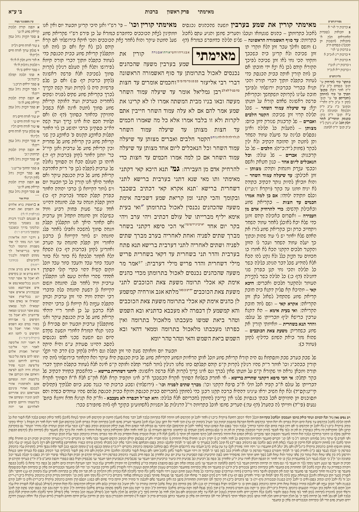
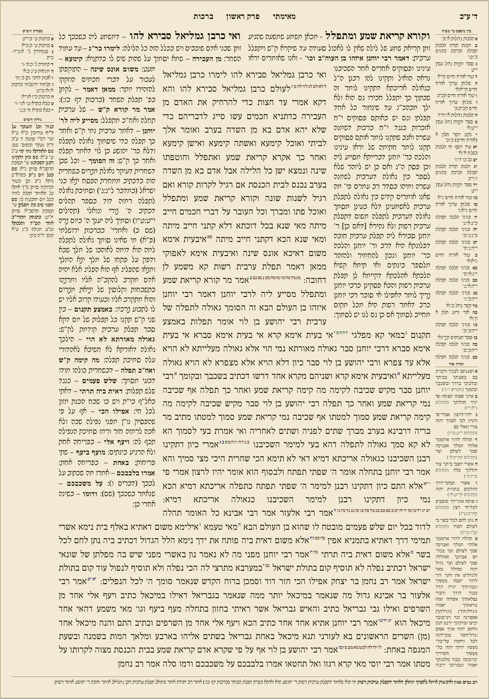
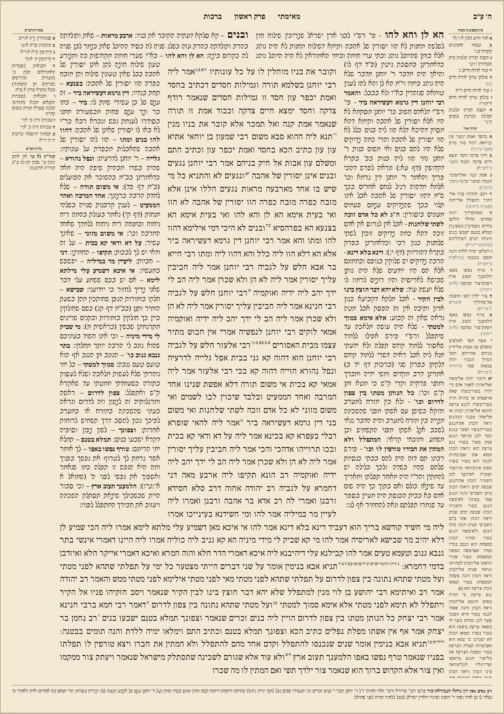
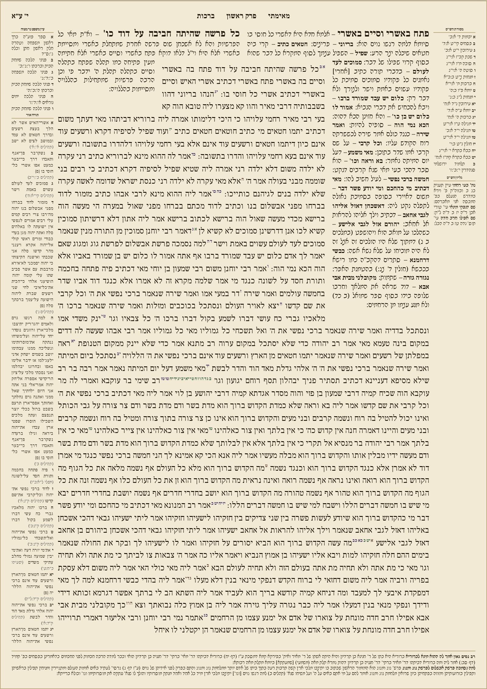
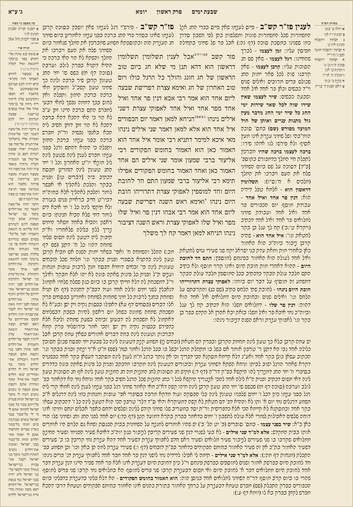
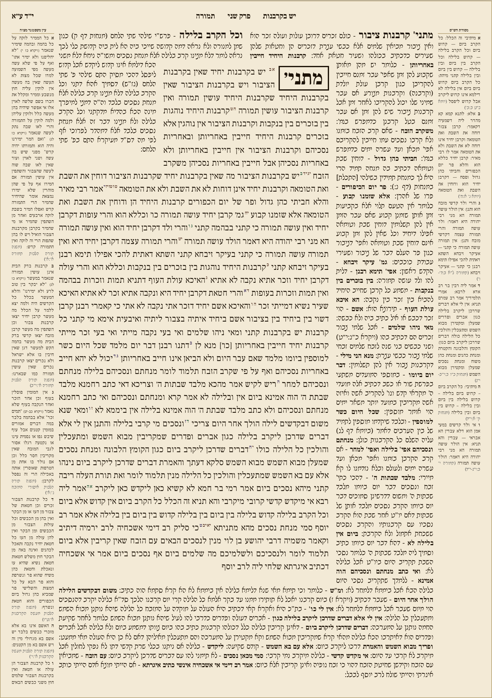

# PROGRESS — Vilna Daf renderer

## June 2026 display fix (evidence-based rebuild)

The deployed renderer was rebuilt around the measured diagnosis of the live build
(14px-wide Gemara on 5b, dead-code engine in `js/`, gitignored fonts/data, live-API
hangs). Root causes RC1–RC8 are fixed:

| RC | Fix |
|----|-----|
| RC1/RC2 (floats + BFC) | The whole `obs-*` float scheme is gone. Each stream is an absolutely-positioned overlay containing exactly **two full-height `shape-outside: polygon()` carve floats**; the text has no float, no width, no `overflow:hidden`. |
| RC3 (measure-once) | Iterate-measure-recompute relaxation, ≤ 8 rounds, true text ends measured with a `Range` around the last text node. Logged per page (`[vilna-daf] relax rounds=… converged=…`). |
| RC4 (no page constraint) | Sheet aspect fixed at w/h = 0.707; a global font scale s ∈ [0.85, 1.15] is searched so max(end_y) ≈ coreH. |
| RC5 (gitignored assets) | `fonts/*.woff2` (Noto Rashi Hebrew + Frank Ruhl Libre, SIL OFL) and `data/**` are committed. |
| RC6 (vocalized text) | Gemara fetched as *William Davidson Edition – Aramaic* (consonantal); all streams additionally strip U+0591–U+05BD, U+05BF–U+05C5, U+05C7 and modern punctuation in one normalize step. |
| RC7 (live API per view) | `scripts/fetch_daf.py` caches full page models (incl. extras + chapter info) to `data/{Tractate}/{page}{side}.json`; cached pages render with **zero** live calls (matrix pages: 130–260 ms). Live fetch (12 s timeouts) remains the fallback for uncached pages. |
| RC8 (two engines) | `js/` (never loaded) and the duplicate `test/` harness are deleted. `index.html` loads `vilna-daf.js`; `harness/check.mjs` tests exactly that file. |

Page chrome: Hebrew-only header (daf numeral at the outer corner, perek name + ordinal +
masechet centered) driven by Sefaria's `alts.Chapters` — the `page===2 && side==='a'` hack is
gone; margins are real grid columns (9% | core | 9%); apparatus renders full note text (every
`.slice(0,N)` removed); Rabbeinu Chananel / Rav Nissim Gaon render as a full-width strip below
the core when the data exists. Amud b mirrors inner/outer (Rashi on the binding side).

### Acceptance matrix (harness/check.mjs, checks §4.1–8)

Run: `bash harness/run.sh` (serves the repo root itself; Playwright + Chromium).

| Page | Result | Load | Relax | Scale | maxEnd / targetCoreH |
|------|--------|------|-------|-------|-----------------------|
| Berachot 2a (chapter start) | PASS | 238 ms | 2 rounds | 0.870 | 863 / 860 |
| Berachot 4b (asymmetric) | PASS | 195 ms | 3 rounds | 0.934 | 1048 / 1042 |
| Berachot 5b (was the 14px catastrophe) | PASS | 164 ms | 3 rounds | 0.861 | 1027 / 1035 |
| Berachot 10a (was the hang) | PASS | 148 ms | 3 rounds | 0.855 | 1001 / 1018 |
| Yoma 3a (commentary-dominant) | PASS | 153 ms | 2 rounds | 0.979 | 1075 / 1065 |
| Temurah 14a (held-out, live fetch, zero per-daf code) | PASS | 1787 ms | 3 rounds | 0.881 | 1056 / 1068 |

Checks per page: (1) sheet aspect within 2% of 0.707, (2) Gemara line ≥ 0.40·coreW + widening
below dead commentaries, (3) zero stream text intersections (line rects via `Range`),
(4) no empty plan-occupied cell in a 3×3 core grid, (5) no diacritics / literal `<` /
`&nbsp;` / `class=` in rendered text, (6) `document.fonts.check('16px RashiScript')` true and
applied, (7) Hebrew-only header with perek pattern, (8) cached load < 2 s and relaxation
converged ≤ 8 rounds.

### Screenshots (rendered output)

The reference `daf-yomi-pdfs/` rasters are not available in this build environment, so the
committed evidence is render-only; pixel comparison against the PDFs (0.707 aspect,
`pdftoppm -r 100`) still needs to be done on a machine that has them.

| Page | Render |
|------|--------|
| Berachot 2a |  |
| Berachot 4b |  |
| Berachot 5b |  |
| Berachot 10a |  |
| Yoma 3a |  |
| Temurah 14a (held-out) |  |

### Known gaps / next steps

- Calibrate C0 / y_top / font ratios by overlaying the reference PDF rasters (needs the
  `daf-yomi-pdfs/` corpus locally), then freeze the constants.
- Pre-fetch the full corpus with `scripts/fetch_daf.py --tractate <name>` per tractate
  (currently cached: the matrix pages + Berachot 2b/3a + Chagigah 9a).
- Mid-page chapter starts (e.g. Berakhot 13a:16) render the Mishnah opening inline; the
  boxed-word treatment currently applies only to chapters that start at the top of a page.
- Torah Or margin notes render the full verse text plus the source ref; margin blocks share
  the column height proportionally (each clipped at its own bottom) so no apparatus block can
  be pushed off the sheet entirely.
- Shekalim is excluded from the held-out pool: the Bavli-printed Shekalim is the Yerushalmi
  and is not addressable as a Bavli daf on Sefaria (`Shekalim.9a` → no such ref). A daf with
  no Gemara text now renders an explicit Hebrew error instead of a blank sheet.
